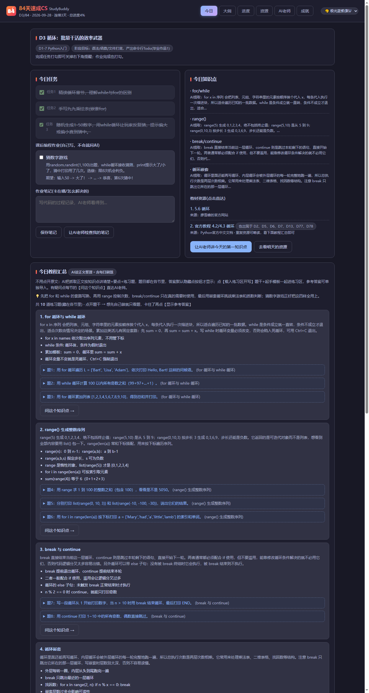
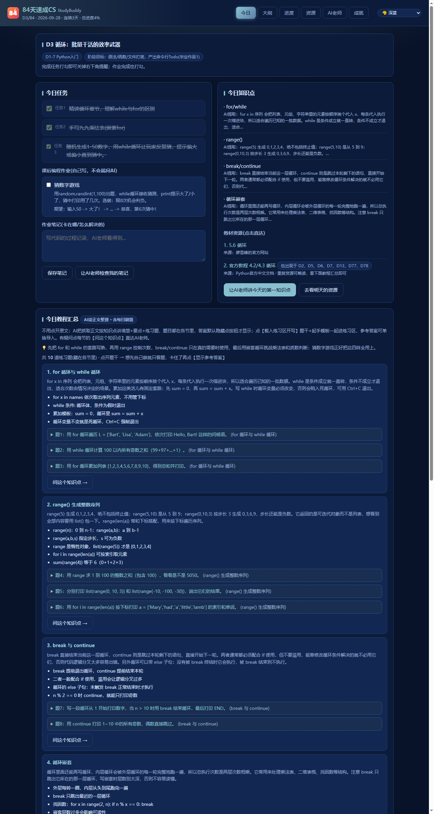
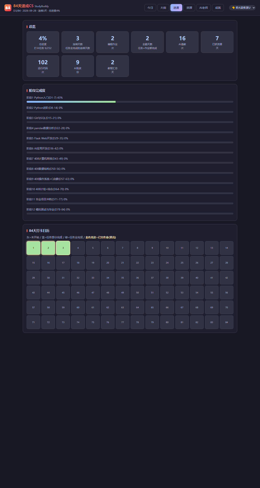
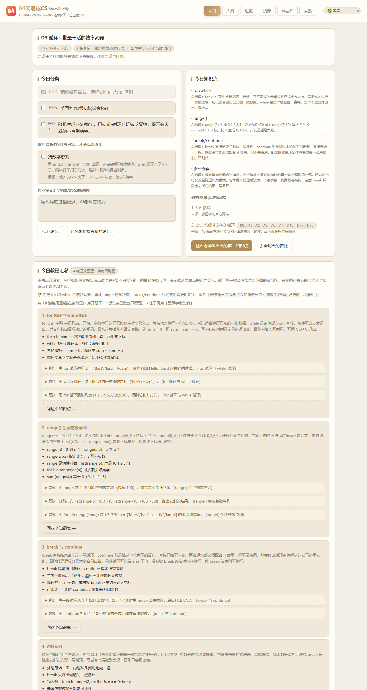

# 学习台 StudyBuddy

[](https://github.com/chenzhongyu331166-hub/study-buddy/stargazers)
[](https://github.com/chenzhongyu331166-hub/study-buddy/network/members)
[](https://github.com/chenzhongyu331166-hub/study-buddy/releases)
[](https://www.python.org/)
[](https://flask.palletsprojects.com/)

**给「84天从零自学CS」造的一站式本地学习台**：每日任务打卡 + AI 老师批改作业 + 自动抓教材做教程汇总 + 终端式代码练习区——全部本地运行、免费 AI 额度，不花一分钱订阅。

A self-hosted 84-day CS study dashboard: daily checklists, AI tutoring & homework grading, auto-fetched course materials, and a terminal-style code playground — runs 100% locally.

- 主线：AI应用开发　副线：数据分析　备选：408考研基础
- 起止：2026-09-26 ~ 84天后，12个阶段，每天 3任务 + 知识点 + 教材资源 + 1个编程作业
- 所有教材链接均为编写时实测可访问的官方/知名教程章节，大纲见 [84天课程大纲.md](./84天课程大纲.md)

## 核心功能

- **代码练习区（终端式交互运行）**：跑本机真 Python，traceback 原样显示；支持预填输入 +
  **运行中继续喂输入**（程序等 input() 时直接打字回车，不用重新运行）；`input()` 提示灰显；
  运行前 lint 提醒 `input()` 多参数/多包引号；报错附中文白话贴士（EOFError/缩进/类型等）
- **今日教程汇总（含每日刷题）**：AI 读当天抓取的教材正文，按知识点分节整理讲解+要点+练习题；
  题目就在各节里（独立刷题区已合并），**参考答案默认隐藏**、点按钮才显示；
  题干可一键当注释**导入练习区**，也可载入起手模板开写；每节直达「问这个知识点」；资源列表自动标出跨天重复链接
- **9 套皮肤**：右上角下拉即切（记忆偏好）——极光蓝紫(默认)/深蓝/墨绿/薰衣草/莫兰迪/黑白/黑金/深红/香槟
- **作业提交区**：贴码直通 AI 老师深度批改（完成度/问题/改法/得分），记录存档可回看，
  批完可一键标记作业完成
- **进度与成就**：84天日历（**交过作业的日期带金色光边**）、12阶段完成度、31枚成就墙
- **每日提醒**：右下角弹窗没打完勾关不掉；单实例 + 当天只自动弹一次

## 界面截图

| 默认(极光蓝紫) | 深蓝 |
|---|---|
|  |  |

| 进度(交作业=金色光边) | 香槟(浅色) |
|---|---|
|  |  |

## 组成

| 文件 | 作用 |
|---|---|
| `build_plan.py` | 生成 `plan.json`（84天大纲，可随时改） |
| `plan.json` | 大纲数据：任务/知识点/资源(带来源)/作业 |
| `app.py` | Flask 学习台服务（打卡/进度/成就/AI老师/资源抓取/交互运行/批改/汇总） |
| `popup.py` | 右下角常驻提醒：没打完勾关不掉，全完成变绿；一天只自动弹一次 |
| `static/index.html` | 学习台页面（今日/大纲/进度/资源/AI老师/成就） |
| `export_outline.py` | 导出《84天课程大纲.md》 |

## 使用

```bat
start.bat        :: 启动服务并打开 http://127.0.0.1:5000
stop.bat         :: 停止服务
```

计划任务（已注册）：

- `StudyBuddy-Server`：开机自启服务
- `StudyBuddy-Logon`：开机补弹提醒（已完成则静默）
- `StudyBuddy-Daily19`：每天 19:00 弹提醒

## 学习流程

1. 19:00 弹窗提醒 → 没打完勾关不掉，完成任务逐个打勾
2. 打开学习台看今日任务/知识点/教材链接，自己写作业
3. 卡住了去「AI老师」提问（魔搭额度，中文，引导式）
4. 今天收尾前去「资源」页点 **今天学完 → 确认明天学这个**，自动抓取明天教材正文存 `resources/` 供核对

## 环境

- Python 3.11 + Flask，依赖见 `requirements.txt`
- AI 接口读取本机 `~/.config/opencode/opencode.jsonc` 的魔搭配置（不入库）
- `data/`（进度/日志）与 `resources/`（教材存档）不入库
